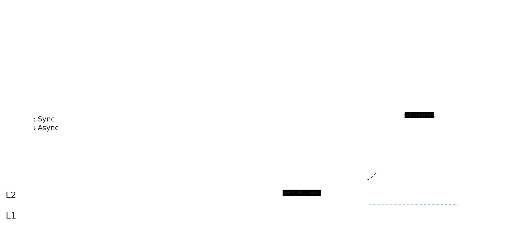

Data Availability
===

**TODO**:

Merge to specification.

## Overview

In Rooch, DA (Data Availability) is a mechanism to ensure that the data(tx lists batch) is avail for async verification:
DA must ensure that within the challenge period, every batch is accessible to at least one honest node.

### Target

For serving the async verification, according I/O model, we have:

Data producer is sequencer: DA provides the producer non-blocking writes as possible.

Data consumer is verifier: DA provides the consumer the most immediate data reads as possible.

To meet our objectives, we require DA to render data visibility as rapidly as possible,
thus enabling verifiers to carry out asynchronous batch data verification after the data digests being documented on L1.
In other words, we don't have to wait for the data/digests to be written to L1 to start the verification.

## Data Flow

In Verifier's perspective (verifier verifies tx), the data flow is as follows:

1. user submits tx to sequencer
2. sequencer batch maker buffer transactions to batch for lower average latency & gas cost
3. sequencer batch maker put to DA server
4. verifier get batch from DA server by:
   1. pull stream from DA server (after booking)
   2. get batch from DA server by batch number
   3. get segment from DA backend (after being submitted to DA backend)

### Put

Put includes three actions:

1. Sequencer batch maker put data to DA server
2. Sequencer batch maker put batch meta to L1
3. DA server put data to DA backend

#### Sequencer to DA Server

Sequencer put batch to DA server, blocking until DA server return response. If failed, sequencer will retry:

In present, sequencer will keep retrying until success. After more DA servers(decentralized) are deployed, majority voting will be introduced.

##### Put Policy (TODO)

Put Policy is a policy to determine data persistence behaviour:

1. lifecycle
2. hot/warm/cold storage
3. encode or not
4. ...

Put Policy is a part of Sequencer configuration. Its principal objective is to provide a more balanced storage solution in terms of both performance and cost.

#### Sequencer to L1

After batch finalized, sequencer will put batch meta to L1 immediately.

#### DA Server to DA Backend

DA server must register on L2 with backend information and update the backend information on L2 prior to each change of backend.

The purpose of DA backend is to mitigate the single point of risk associated with DA server. DA server, 
not the backend, remains the principal party responsible for data publication. Therefore, the DA server may elect to submit data to DA backend asynchronously.

##### Stream

DA server is obligated to pay fees to DA backend and is subject to its interface restrictions. 
Particularly in the forthcoming decentralized DA server cluster, faced with a variety of different DA backend implementations,
we require the DA server to maintain flexibility and low cost in its implementation while providing a unified interface.
Rooch Network accomplishes our objectives by treating the transaction sequence as a stream and flexibly dividing it into segments:

1. Each network has its own stream.
2. Several batch form an extent for better compression ratio.
3. Every extent, once compressed, will be partitioned into numerous segments to comply with the block size restrictions of the DA backend. 
Simultaneously, this approach aids in augmenting parallelism.

### Get

There are various ways to get batch data. DA Batch could be verified by meta on L1.

#### Bypass DA server accessing DA Backend directly

Verifier could access DA backend directly to get data. However, it's not recommended because of the following reasons:

1. DA backend might lag behind the most recent data, given the likelihood of its data being uploaded asynchronously.
2. DA backend might be slow to respond to requests, DA server is the professional storage node.
3. DA server, accountable for data accessibility, risks forfeiture of its deposit via arbitration if it fails to meet the conditions of data availability.

This methodology may be employed to access data in the event that all DA servers are unable to respond appropriately.

#### Booking DA Stream by DA server（TODO）

Verifier subscribe to a data stream from the DA server.

#### Get DA Batch by DA server

DA server maintains a batch index, which is updated in real time as new batches are added. Anyone could get batch by batch number.

#### Scaling

Anyone can become an unpledged, non-liability DA server to facilitate horizontal scaling of data access, 
with each DA server being homogeneous. Pledged nodes will receive data pushed by the sequencer, garner community rewards,
and be supervised by the community. Unpledged nodes can fetch data from other nodes; 
these may be nodes operated by the Rooch network to enhance network throughput, 
backup nodes established by other community participants for various needs, 
or efforts made with the intention of joining the pledged network in the future.

#### Data Integrity  (TODO)

Each batch is recorded on L1 via an accumulator. Given that the segments, post-partitioning, 
are ultimately written onto the DA backend, the batches can be sufficiently large to compensate for the speed difference between L1 and L2.
Verifiers can initially trust the data from DA server optimistically, and perform verification once L1 completes the synchronization of the accumulator. 
DA server will sign the data summary, and if it does not match with L1, a challenge can be initiated against DA server.

## Roadmap

DA is not merely a coding project, but also a community venture. Rooch Network will gradually achieve decentralized DA services in unison with the community.

### Phase 1: Single DA Server

Operated by the Rooch Network.

#### As a component of Sequencer: PoC

#### Independent from Sequencer

### Phase 2: Decentralized DA Servers

Data Visibility (DV) will be the acceleration component of DA.