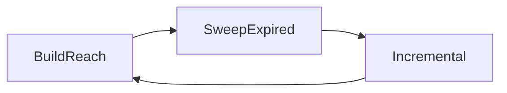

# Rooch Pruner Guide

## Overview

This guide provides a comprehensive overview of the Rooch state pruner, a critical component that manages storage space reclamation by cleaning up unused state data. The pruner operates as a hybrid system combining batch cleanup (V1) with incremental sweeping (V2) capabilities.

## Architecture

### Three-Phase Pruning Cycle

The pruner operates in a continuous three-phase cycle:

1. **BuildReach Phase**: Identifies reachable state nodes using parallel DFS with Bloom filtering
2. **SweepExpired Phase**: Processes expired state roots in batches with aggressive compaction
3. **Incremental Phase**: Performs continuous cleanup of remaining stale nodes



## Configuration

### Current Configuration Parameters

```rust
pub struct PruneConfig {
    /// Enable or disable background pruner
    pub enable: bool,

    /// Whether boot cleanup (v1 DFS) already finished
    pub boot_cleanup_done: bool,

    /// Number of nodes to scan per DFS batch
    pub scan_batch: usize,                    // default: 10,000

    /// Number of deletion operations per RocksDB write batch
    pub delete_batch: usize,                   // default: 5,000

    /// Background tick interval in seconds
    pub interval_s: u64,                      // default: 60

    /// Bloom filter size in bits (must be power of two)
    pub bloom_bits: usize,                    // default: 8,589,934,592 (2^33 ≈ 1GB)

    /// Create and use cf_reach_seen column family for cold hash spill
    pub enable_reach_seen_cf: bool,           // default: false

    /// Number of recent tx_orders to protect from pruning
    pub protection_orders: u64,                // default: 30000

    /// Enable incremental sweep phase for continuous cleanup
    pub enable_incremental_sweep: bool,       // default: true

    /// Batch size for incremental sweep operations
    pub incremental_sweep_batch: usize,        // default: 1000
}
```

### Configuration Optimization

The default configuration prioritizes correctness over memory efficiency. For production deployments, consider these optimizations:

#### Small Deployments (< 1M nodes)
```toml
[pruner]
enable = true
scan_batch = 1_000
delete_batch = 500
interval_s = 120
bloom_bits = 8_000_000          # 1MB instead of 1GB
enable_incremental_sweep = true
incremental_sweep_batch = 500
```

#### Medium Deployments (1M-10M nodes)
```toml
[pruner]
enable = true
scan_batch = 5_000
delete_batch = 2_000
interval_s = 60
bloom_bits = 80_000_000         # 10MB
enable_reach_seen_cf = true
enable_incremental_sweep = true
incremental_sweep_batch = 1000
```

#### Large Deployments (> 10M nodes)
```toml
[pruner]
enable = true
scan_batch = 10_000
delete_batch = 5_000
interval_s = 30
bloom_bits = 800_000_000        # 100MB
enable_reach_seen_cf = true
enable_incremental_sweep = true
incremental_sweep_batch = 2000
```

## Phase Details

### 1. BuildReach Phase

**Purpose**: Constructs reachable set via parallel DFS from live roots using Bloom filters

**Process**:
1. Load current startup state root as live root
2. Execute parallel DFS traversal
3. Update Bloom filter with reachable nodes
4. Persist Bloom filter snapshot

**Key Optimizations**:
- Parallel traversal using Rayon
- Bloom filter for deduplication
- Checkpoint recovery support

### 2. SweepExpired Phase

**Purpose**: Processes expired state roots in mini-batches with aggressive compaction

**Process**:
1. Load snapshot from BuildReach phase
2. Iterate through expired state roots
3. Batch process roots with size limits
4. Trigger aggressive compaction every 200 roots

**Performance Features**:
- Mini-batch processing (1000 roots per batch)
- Configurable batch sizes
- RocksDB compaction optimization

### 3. Incremental Phase

**Purpose**: Performs continuous cleanup of remaining stale nodes

**Current Status**: ✅ **ENABLED** (Previously disabled, now fully functional)

**Process**:
1. Load latest prune snapshot
2. Identify stale nodes with zero refcount
3. Batch delete stale nodes
4. Update refcount and index stores
5. Transition back to BuildReach

**Configuration**:
- Controlled by `enable_incremental_sweep` flag
- Configurable batch size via `incremental_sweep_batch`
- Graceful degradation when disabled

## Monitoring

### Prometheus Metrics

The pruner provides comprehensive monitoring through the following metrics:

#### Key Performance Metrics
- `pruner_reachable_nodes_scanned`: Number of nodes scanned during reachability analysis
- `pruner_sweep_nodes_deleted`: Number of nodes deleted during sweep operations
- `pruner_processing_speed_nodes_per_sec`: Processing speed in nodes per second

#### System Metrics
- `pruner_current_phase`: Current pruning phase (0=BuildReach, 1=SweepExpired, 2=Incremental)
- `pruner_bloom_filter_size_bytes`: Bloom filter memory usage
- `pruner_error_count`: Error counts by operation type and phase

#### Resource Metrics
- `pruner_disk_space_reclaimed_bytes`: Estimated disk space reclaimed

### Example Monitoring Queries

```promql
# Average pruning speed
rate(pruner_processing_speed_nodes_per_sec[5m])

# Nodes deleted in last hour
increase(pruner_sweep_nodes_deleted[1h])

# Current pruning phase
pruner_current_phase

# Error rate
rate(pruner_error_count[5m])
```

## Implementation Status

### ✅ Completed Features

1. **Complete Three-Phase Cycle**: All phases fully implemented and integrated
2. **Incremental Sweeping**: V2 phase now enabled with configurable parameters
3. **Comprehensive Monitoring**: Full Prometheus metrics integration
4. **Error Handling**: Robust error recovery and logging
5. **Configuration Management**: Flexible configuration for different deployment sizes

### 🔄 Recent Improvements

1. **Incremental Phase Activation**: Previously disabled "do Nothing" implementation replaced with full `IncrementalSweep` integration
2. **Enhanced Metrics**: Added business-critical metrics for production monitoring
3. **Configuration Extension**: Added `enable_incremental_sweep` and `incremental_sweep_batch` parameters
4. **Error Resilience**: Improved error handling that continues processing individual node failures

## Performance Characteristics

### Memory Usage

- **Bloom Filter**: Configurable size, typically 1-100MB depending on deployment scale
- **Batch Processing**: In-memory processing with configurable batch sizes
- **Reach Seen CF**: Optional column family for large-scale deployments

### Processing Speed

- **BuildReach**: Parallel processing scales with CPU cores
- **SweepExpired**: Bounded by RocksDB write performance
- **Incremental**: Small batch processing minimizes impact on main operations

### Storage Impact

- **Space Reclamation**: Efficient cleanup of unreachable nodes
- **Compaction**: Aggressive compaction during sweep phase
- **Metadata Overhead**: Refcount and stale indices for incremental operations

## Best Practices

### Deployment Recommendations

1. **Start Small**: Begin with conservative batch sizes and monitor performance
2. **Enable Monitoring**: Ensure Prometheus metrics are collected and alerting configured
3. **Tune Bloom Filter**: Adjust `bloom_bits` based on node count vs. memory constraints
4. **Phase Timing**: Consider adjusting `interval_s` based on system load patterns

### Configuration Tips

1. **Memory-Constrained Environments**: Reduce `bloom_bits` and batch sizes
2. **High-Performance Systems**: Enable `enable_reach_seen_cf` and increase batch sizes
3. **Production Monitoring**: Set up alerts for error rates and processing speed
4. **Testing**: Validate configurations in staging environments before production deployment

### Troubleshooting

#### Common Issues

1. **High Memory Usage**: Reduce `bloom_bits` from default 1GB to smaller values
2. **Slow Processing**: Increase batch sizes or enable `enable_reach_seen_cf`
3. **Frequent Errors**: Check RocksDB health and disk space availability
4. **Incremental Phase Issues**: Verify `enable_incremental_sweep` is set to `true`

#### Debug Mode

Enable detailed logging to diagnose issues:
```rust
// Set RUST_LOG=debug for detailed pruner logging
export RUST_LOG=debug
```

## Testing

### Unit Tests

Core functionality is validated through comprehensive unit tests:
- `test_incremental_sweep`: Validates incremental sweep functionality
- `test_reachable_and_sweep`: Tests coordination between phases
- `test_bloom_filter_basic`: Verifies Bloom filter operations

### Integration Tests

End-to-end testing validates complete pruning cycles:
- Configuration impact analysis
- Performance benchmarking
- Memory usage validation

### Performance Benchmarks

Benchmark tests available for:
- Bloom filter performance
- Reachability construction speed
- Sweep operation efficiency
- Concurrent processing capabilities

Run benchmarks:
```bash
cargo bench -p rooch-pruner
```

## Future Enhancements

### Planned Improvements

1. **Adaptive Configuration**: Dynamic parameter adjustment based on system metrics
2. **Enhanced Monitoring**: More granular metrics and alerting
3. **Performance Optimization**: Further memory and CPU efficiency improvements
4. **Advanced Recovery**: Improved error recovery and data consistency guarantees

### V2 Incremental Enhancements

While the incremental phase is now functional, ongoing work includes:
- Enhanced concurrent safety mechanisms
- Improved integration with state update paths
- Advanced configuration and tuning options

## Conclusion

The Rooch pruner provides a robust, configurable solution for storage space reclamation. With its hybrid approach combining batch processing with incremental cleanup, it offers both efficiency and reliability for production deployments.

The recent improvements have transformed the pruner from a batch-only system into a comprehensive solution with:
- ✅ Fully functional incremental sweeping
- ✅ Comprehensive monitoring and metrics
- ✅ Flexible configuration options
- ✅ Production-ready error handling

This ensures continuous, efficient storage space reclamation while maintaining system stability and observability.