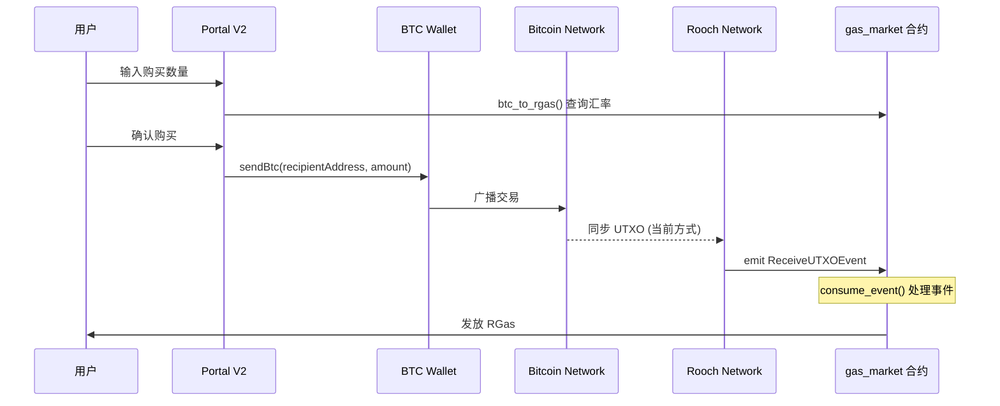
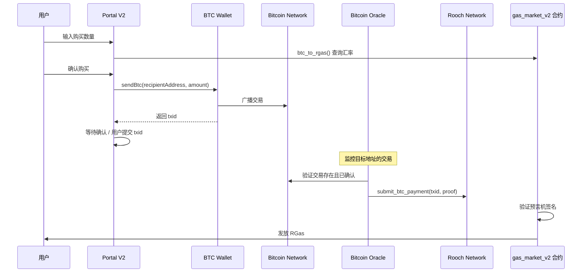
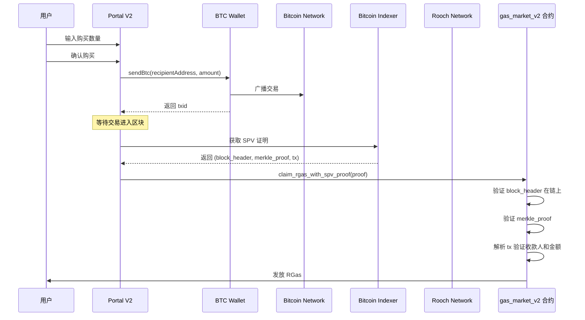

# Bitcoin Header-Only Mode: RGAS Purchase Mechanism Redesign

## Background

当前 rooch-portal-v2 中基于 Bitcoin 购买 RGAS 的机制依赖于 `ReceiveUTXOEvent` 事件，该事件在 UTXO 同步时触发。由于后续将只同步 Bitcoin header，UTXO 数据将不再可用，需要设计新的解决方案。

### 当前实现流程

### 核心问题

- `gas_market::consume_event()` 依赖 `ReceiveUTXOEvent` 来验证 BTC 收款
- `ReceiveUTXOEvent` 由 `bitcoin_move::utxo` 模块在同步 UTXO 时触发
- Header-only 模式下，不再同步 UTXO，因此无法触发此事件

---

## 方案设计

### 方案 1: 外部预言机验证

使用外部 Bitcoin 预言机服务来验证 BTC 交易，替代 UTXO 同步机制。

**优点:**
- 解耦对 UTXO 全量同步的依赖
- 可复用现有的 `trusted_oracle` 模块
- 支持可配置的确认数要求

**缺点:**
- 需要运行预言机服务
- 引入对预言机的信任假设

---

### 方案 2: SPV 证明 (推荐)

用户提交 Bitcoin 交易的 SPV 证明，合约验证 Merkle 证明后发放 RGas。

**优点:**
- 无需信任第三方预言机
- 利用已同步的 Bitcoin headers 进行验证
- 与 Bitcoin Light Client 理念一致

**缺点:**
- 需要实现 Bitcoin 交易解析和 Merkle 证明验证
- 前端复杂度增加，需要构造 SPV 证明
- Gas 费用较高 (需要验证证明)

---

## 推荐方案: SPV 证明

综合考虑实现复杂度和安全性，**推荐采用 SPV 证明方案**:

1. **符合 header-only 模式设计理念** - 既然选择只同步 header，就应该利用 header 来做验证
2. **无需额外信任假设** - 不依赖预言机
3. **可复用现有基础设施** - 利用已同步的 block headers

### 核心改动

#### 1. 合约改动 (`apps/gas_market/`)

新增 `gas_market_v2.move`:

| 函数 | 说明 |
|------|------|
| `claim_rgas_with_spv_proof(proof: SPVProof)` | 用户提交 SPV 证明领取 RGas |
| `verify_btc_payment(proof: SPVProof)` | 验证 SPV 证明的有效性 |

需要新增/使用的模块:
- `bitcoin_move::types` - Bitcoin 交易解析
- `bitcoin_move::light_client` - 验证 block header 存在
- 新增 `bitcoin_move::spv` - Merkle 证明验证

#### 2. 前端改动 (`infra/rooch-portal-v2/`)

| 文件 | 改动 |
|------|------|
| `src/sections/gas-swap/index.tsx` | 修改购买流程，增加等待确认和提交证明步骤 |
| `src/hooks/gas/use-spv-proof.ts` | 新增 Hook，从 Bitcoin 索引服务获取 SPV 证明 |
| `src/hooks/gas/use-claim-rgas.ts` | 新增 Hook，提交 SPV 证明领取 RGas |

#### 3. 后端服务 (可选)

可以提供一个 SPV 证明生成服务，简化前端实现:
- 输入: txid
- 输出: block_header, merkle_proof, raw_tx

---

## 用户交互流程 (新)

1. **用户输入 BTC 数量** → 显示预计获得 RGas
2. **用户确认并发送 BTC** → 钱包弹出确认
3. **交易广播成功** → 显示等待确认状态
4. **交易被确认** (等待 N 个区块) → 自动或手动获取 SPV 证明
5. **提交证明领取 RGas** → 调用合约验证并发放

---

## 开放问题

1. **确认数要求**: 需要多少个 Bitcoin 区块确认才能领取 RGas?
2. **SPV 证明来源**: 
   - 使用现有公共服务 (如 mempool.space API)?
   - 还是自建索引服务?
3. **是否保留预言机作为备选**: 作为 SPV 方案的补充?
4. **旧合约迁移**: 现有 `gas_market` 合约的处理方式?
