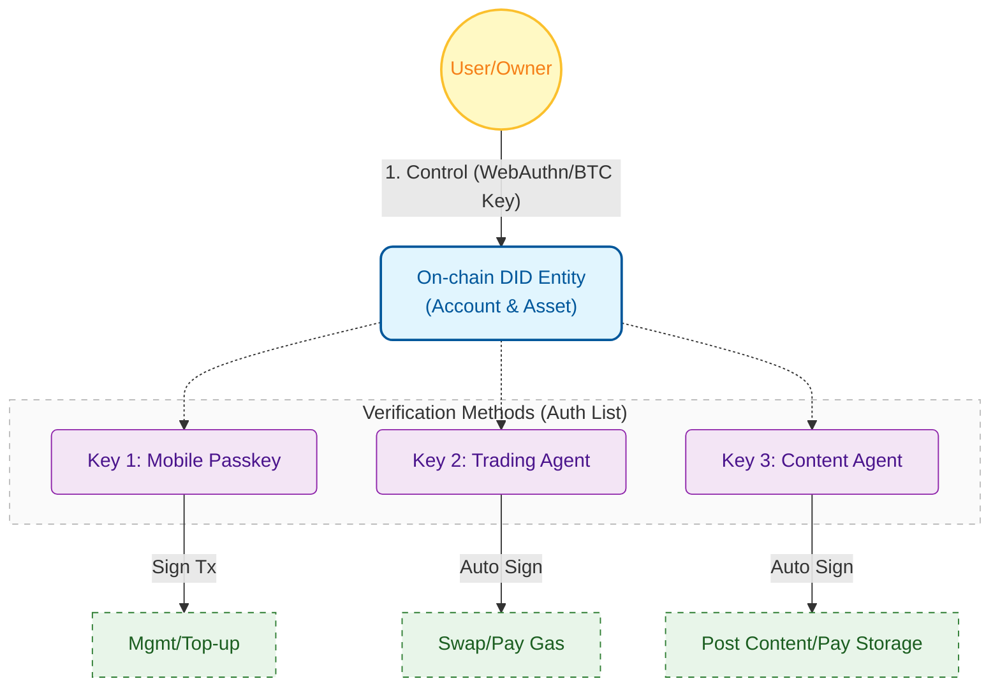

import PostHeader from "/components/blog/postHeader";

<PostHeader />

With the explosion of Large Language Models (LLMs), we are at a pivotal moment evolving from "Generative AI" to "Agentic AI". AI is no longer just a tool for generating text or images; they are beginning to act as independent "Agents", holding assets on-chain, paying for LLM APIs or MCP services, and even engaging in instant payments and collaboration with other Agents.

However, when we apply existing Web3 infrastructure to these 24/7 online digital lives, a core contradiction emerges: **How do we give AI a secure, persistent, and manageable identity?**

This article explores the identity dilemma facing AI Agents and introduces how Rooch Network's DID solution provides a native on-chain habitat for AI Agents by decoupling "identity" from "keys".

## The "Identity" Dilemma of AI Agents

In traditional blockchain architecture, **Identity equals Private Key**. One address corresponds to one key; whoever holds the key owns the address. This design is barely adequate for human users, but it is fatal for AI Agents.

### 1. Private Key Dependency and the Security Paradox
Human users can store private keys offline using cold wallets or hardware wallets, bringing them out only when signing is needed. But AI Agents need to run 24/7, monitoring markets and responding to requests. This means the Agent's private key must be stored in the server's memory or environment variables (i.e., a "hot wallet").

Once the server is compromised and the private key leaked, the Agent's "life" is over. Attackers can drain all assets and even use this identity for malicious operations, destroying the Agent's accumulated reputation.

### 2. Rigid Management and Reputation Breaks
If you discover that an Agent's private key might be compromised, or if you want to upgrade the Agent's model and take over the original business with a new server, under the current system, you typically can only **change the address**.

But in the Web3 world, **changing an address is equivalent to "reincarnation"**. The interaction records, credit scores, and whitelist qualifications accumulated by the old address cannot be carried over to the new one. Agents are trapped in a dilemma: "either risk security by not changing keys, or lose reputation by changing keys".

**AI Agents need a mechanism that can "materialize" their identity, realizing the separation of Ownership and Execution Right.**

## The DID Standard: Underrated AI Infrastructure

To solve the identity problem, W3C established the Decentralized Identity (DID) standard. This standard includes three core concepts whose design philosophy naturally fits the needs of AI Agents, yet is often underestimated by the market:

1.  **Identifier**: A globally unique ID (format like `did:method:identifier`) representing the identity itself.
2.  **Controller**: The entity with the right to modify the DID document (usually the user's private key).
3.  **Verification Method**: A list of public keys used to verify signatures for that identity.

**The core wisdom of this architecture lies in "decoupling"**: It separates "who owns the identity (Controller)" from "who acts on behalf of the identity (Verification Method)".

However, current market applications of DID mainly focus on **off-chain authentication** (like diploma verification, KYC), merely using DID as a hook for hanging Verifiable Credentials (VCs). This "lightweight" usage wastes the huge potential of the DID standard in **authorization management**.

**Rooch Network is not reinventing the wheel but returning to the origin of the DID standard**: We have implemented this standard natively on-chain, making DID not just a "certificate" for display, but an "on-chain entity" capable of holding assets and executing transactions.

## Rooch DID — Identity as an Entity

Rooch Network is committed to filling this gap by **natively integrating the W3C DID standard**, providing AI Agents with an on-chain habitat that is as secure as Bitcoin and as flexible as a Web2 account.

The core philosophy of Rooch DID is to upgrade identity from "a string of address" to an "on-chain entity". In Rooch, a DID is no longer a vacuous concept but a tangible on-chain Object. This object possesses the following key characteristics:

1.  **Materialized Identity**: DID is an on-chain object possessing `AccountCap` (Account Capability). This means the object itself represents an account and can hold assets.
2.  **Controller (Owner)**: The Controller is the actual controller of the DID, possessing the highest authority.
    *   Currently, Rooch natively supports two controller formats: **`did:bitcoin`** (Bitcoin wallet) and **`did:key`** (public key derivation).
    *   Support for `did:key` means you can directly use **WebAuthn devices (like FaceID, TouchID)** as a Controller, without managing complex mnemonic phrases.
    *   In the future, Rooch will expand support to include more formats like **`did:ethereum`**, meaning you can use a wallet from any chain to manage your AI Agent on the Rooch network.
3.  **Verification Methods (Executor)**: This is a list of authorized public keys. They are the Agent's "badge".

Through this design, Rooch realizes **"Persistent Identity, Transient Keys"**.

> **💡 Tech Decode: On-Chain DID Document Structure**
>
> For developers, the essence of Rooch DID is an Object stored in the Move layer. Here is a simplified schematic of its core data structure:
>
> ```move
> struct DIDDocument has key {
>     // Identity ID, e.g., did:rooch:0x123...
>     id: DID,
>     // Controller list, possessing highest management authority
>     controller: vector<DID>,
>     // Verification method map (public key list), where Agent's Keys are stored
>     verification_methods: SimpleMap<String, VerificationMethod>,
>     // Authentication relationship, defining which Keys can be used for identity authentication
>     authentication: vector<String>,
>     // ... other standard DID fields (like capability_invocation, etc.)
>     
>     // Service endpoints, used for service discovery
>     services: SimpleMap<String, Service>,
>     // Core capability: Holds the AccountCap of this DID account
>     // This gives the Object permission to operate account assets
>     account_cap: AccountCap,
> }
> ```
> This structure ensures that DID is not just a static document, but a dynamic entity with asset operation permissions.

## Practical Walkthrough: How to Manage Your AI Agent

Let's look at how Rooch DID works through a scenario: Suppose you deploy an AI Agent to help you perform on-chain arbitrage transactions 24/7.

### Step 1: Delegation
First, you create a DID entity on Rooch using your wallet (such as a Bitcoin cold wallet or Passkey). This DID is the carrier of your assets and reputation.

Then, you generate a new pair of public and private keys for the AI Agent on the server. You don't need to give your Controller private key to the Agent, nor do you need to transfer money to the Agent. You only need to initiate a transaction to register the Agent's **public key** into the DID's verification method list and grant it "execute transaction" permission.

At this point, the Agent is like receiving an "employee card" from your company.

### Step 2: Execution
The AI Agent starts working. When it discovers an arbitrage opportunity, it signs the transaction using **its own private key**.

When this transaction is submitted to the Rooch network, the built-in DID validator checks:
1. Which public key does this signature correspond to?
2. Is this public key in the "employee list" of this DID?
3. Is the permission valid?

After validation passes, the transaction is executed under the identity of the DID. To the outside world, it is this DID that performed the operation, and the accumulated transaction records and reputation belong to this DID.

> **💡 Tech Decode: Native Validator**
>
> Why can an Agent directly sign on behalf of a DID using its own private key? This is because Rooch introduces a system-level `auth_validator` mechanism.
>
> When a transaction is submitted, it doesn't need to go through a complex EntryPoint contract like Ethereum AA, but is intercepted directly by the underlying DID Validator:
> 1.  **Read**: The Validator reads the on-chain `DIDDocument` object based on the transaction sender's address.
> 2.  **Lookup**: It looks up the corresponding public key in `verification_methods` based on the Key ID carried in the transaction.
> 3.  **Verify**: It verifies if the signature is valid and checks permissions (such as `authentication` or `capability_invocation`).
> 4.  **Execute**: After validation passes, the VM executes the transaction logic.
>
> This native design makes DID transaction Gas consumption extremely low and execution efficiency extremely high.

### Step 3: Rotation / Revocation
Suppose one day you discover abnormal traffic on the server running the Agent and suspect it has been hacked.

You don't need to panic and transfer assets. You only need to use your Controller (wallet or Passkey) to send one instruction: **Remove the Agent's public key from the DID**.

At the moment this transaction is confirmed on-chain, the private key in the Agent's hand becomes completely invalid. Even if the hacker gets the Agent's private key, they can no longer operate any assets in the DID.

Subsequently, you can deploy a new secure environment, generate new keys, and register them to the DID again. To the outside world, your DID identity hasn't changed, assets and reputation are intact; you just changed a "worker".

## Mass Adoption: Letting Every User Own an AI Agent with Zero Threshold

If we want everyone to own their own AI Agent, asking users to first learn how to create a wallet and backup mnemonic phrases is a huge barrier.

Rooch introduces **CADOP (Custodian-Assisted DID Onboarding Protocol)** to solve this problem.

Through CADOP, application platforms (Custodians) can assist users in creating DIDs seamlessly. Users only need to use a device supporting Passkey (such as a mobile phone or computer) to generate a secure key pair locally as a Controller Key, and the platform assists in completing the on-chain DID initialization transaction.

**The key point is**: Although the platform assists in creation, the Controller authority of the DID still fully belongs to the user. The platform only acts as a "gatekeeper" or "Gas Payer" and cannot control the user's DID.

This paves the way for the explosion of AI Consumer Apps: users can obtain their own secure, asset-accumulating AI Agent identity without perceiving the complexity of the blockchain.

## Architecture Overview

To help everyone intuitively understand how DID connects the multi-terminal ecosystem, we show a typical application architecture diagram:



In this architecture:
*   **User** always holds the highest control authority.
*   **Different business scenarios** are executed by different Agents (Keys).
*   All interactions ultimately belong to the **same DID entity**.

## Future Agent Network

Rooch DID not only solves safety management issues but also lays the foundation for the future Agent economy network.

### Service Discovery
The DID document can store not only keys but also **Service Endpoints**. An Agent can declare in its DID: "I provide price prediction services, API address is xxx".

Other Agents can automatically discover these services through on-chain DID data and verify the identity reputation of the service provider, thereby realizing fully decentralized M2M (Machine to Machine) collaboration.

### Governance Evolution
Although the Controller is currently mainly the user's personal wallet, Rooch's architecture supports flexible upgrades of the Controller. In the future, the Controller of an AI Agent can be a DAO or a multi-sig wallet. This means we can build "Public Good AI" governed by the community, where its code of conduct and upgrade logic are determined by on-chain governance.

## Conclusion

The real AI economy cannot be built on fragile private keys. Rooch DID provides a secure, persistent, and evolvable on-chain habitat for AI Agents by decoupling "identity" from "control".

We believe that only when AI Agents possess true sovereign identity and are no longer "temporary scripts" that can disappear at any time, can they truly become first-class citizens of the digital economy and build a prosperous on-chain world together with humans.

