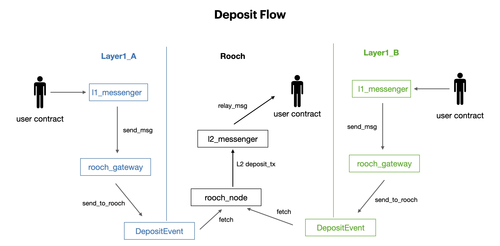
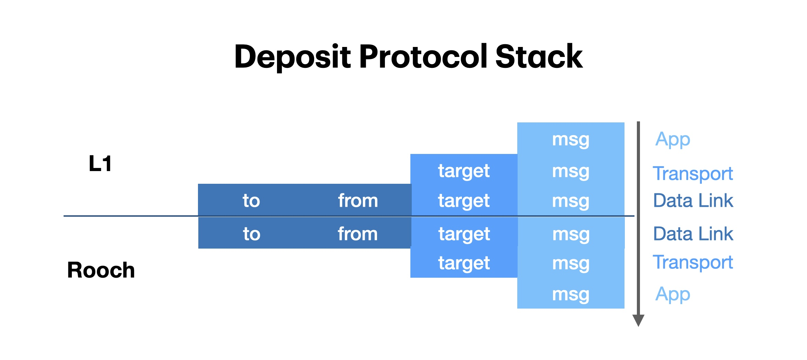

# 存款流程

## 概述

存款在 Rooch 语境中指代一切由 L1 触发的 L2 交易。（并不局限于资产转移）

Rooch 具备多链资产结算的能力，对于每一条 L1 来说，其存款流程一致（注：合约名及其参数受不同智能合约语言影响略有不同）。都是从 L1
的消息开始经过层层封装传递到 L2 对应的合约之中进行消费：

我们需要保证来自 L1 的消息能够 `rooch_node` 正确的解析并中继给相应的合约，从协议栈的角度来看：

## L1

1. 用户通过 `send_msg` 函数向 `l1_messenger` 发起存款请求，所需参数包括:
   1. `target`: L2 合约地址
   2. `msg`: L2 tx 的 calldata 
   3. `min_gas_amount`: L2 上允许使用的最小 gas 数量，即对调用 `target` 的估计值。
   考虑到 L2 需要在调用 `target` 之前的处理开销，实际开销肯定会超过这个值。详见 [Gas Fees](#gas-fees)。

   `l1_messenger` 提供了较为友好的接口，调用者只需关心 L2 调用信息而无需关注信息封装和传递。

2. `l1_messenger` 将调用 `rooch_linker` 的 `send_to_rooch` 函数，
   `rooch_linker` 为 L1 与 L2 通信的底层合约。`send_to_rooch` 参数包括：
   1. `to`: 对应的 L2 Messenger 合约地址。在这个场景中为 `l2_messenger` 合约地址
   2. `gas_amount`: 基于 `min_gas_amount` 以及 L2 上消息传递开销估算得到的 L2 上 gas 开销
   3. `data`: `relay_msg_data` 编码后数据 (`msg_sequence` `msg_sender` `target` `msg` `min_gas_amount` 等必要信息)

3. `send_to_rooch` 在完成检查后，发出 `TxDepositedEvent` 事件，其中包括：
   1. `from`: L1 发起存款的用户地址
   2. `to`: l2_messenger 合约地址
   3. `deposit_version`: event 版本号
   4. `event_data`: 在 `relay_msg_data` 基础上增加了 `gas_amount` 字段

## L2

1. `rooch_node` 监听 `TxDepositedEvent` 事件，解析其中的参数，并封装为 `deposit_tx`
2. 将 `deposit_tx` 传递给 `l2_messenger` 的 `relay_message` 函数，参数包括：
   1. `sequence`: 中继消息序列号
   2. `sender`: 消息发送方
   3. `target`: L2 合约地址
   4. `min_gas_amount`: L2 上允许使用的最小 gas 数量，即对调用 `target` 的估计值。
   5. `msg`: L2 tx 的 calldata 
3. `relay_message` 在完成检查后，调用 `target` 合约

## Gas Fees

Gas变速器，通过 L1 循环燃烧 -> DoS 防护机制

### 多链机制

TODO 不同链就像齿轮替换

## 重放消息

