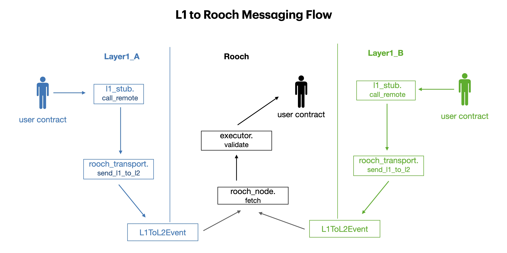

# L1 至 L2 的消息传递

## 概述

L1 至 L2 的消息传递由 L1 触发的 L2 交易实现。（资产转移基于此机制实现）

Rooch 具备多链资产结算的能力，对于每一条 L1 来说，其 L1 to L2 流程一致（注：合约名及其参数受不同智能合约语言影响略有不同）。都是从 L1
的消息开始经过层层封装传递到 L2 对应的合约之中进行消费：



我们需要保证来自 L1 的消息能够 `rooch_node` 正确的解析并中继给相应的合约，从协议栈的角度来看：


## L1

1. 用户通过调用 `l1_stub` 中的 `call_remote` 函发起 `L1ToL2` 请求，所需参数包括:
   1. `target`: L2 合约地址
   2. `msg`: L2 tx 的 calldata 
   3. `min_gas_amount`: L2 上允许使用的最小 gas 数量，即对调用 `target` 的估计值。
   考虑到 L2 需要在调用 `target` 之前的处理开销，实际开销肯定会超过这个值。详见 [Gas Fees](#gas-fees)。

   `l1_stub` 提供了较为友好的接口，调用者只需关心 L2 调用信息而无需关注信息封装和传递。

2. `l1_stub` 将调用 `rooch_transport` 的 `send_l1_to_l2` 函数，
   `rooch_transport` 为 L1 与 L2 通信的底层合约。`send_l1_to_l2` 参数包括：
   1. `to`: 对应的 L2 Stub 合约地址。在这个场景中为 `l2_stub` 合约地址
   2. `gas_amount`: 基于 `min_gas_amount` 以及 `msg` 尺寸估算得到的 L2 上的基础 gas 开销
   3. `data`: `relay_msg_data` 编码后数据 (`msg_sequence` `msg_sender` `target` `msg` `min_gas_amount` 等必要信息)

3. `send_l1_to_l2` 在完成检查后，发出 `L1ToL2Event` 事件，其中包括：
   1. `from`: 发起 `send_l1_to_l2` 的 L1 账户地址/合约别名。在这里是 `l1_stub`
   2. `to`: `l2_stub` 合约地址
   3. `L1ToL2Event_version`: event 版本号
   4. `event_data`: 在 `relay_msg_data` 基础上增加了 `gas_amount` 字段

## L2

1. `rooch_node` 监听 `L1ToL2Event` 事件，解析其中的参数，并封装为 `l1_to_l2_tx`
2. 将 ` l1_to_l2_tx` 传递给 `l2_stub` 的 `relay_message` 函数，参数包括：
   1. `sequence`: 中继消息序列号
   2. `sender`: 消息发送方
   3. `target`: L2 合约地址
   4. `min_gas_amount`: L2 上允许使用的最小 gas 数量，即对调用 `target` 的估计值。
   5. `msg`: L2 tx 的 calldata 
3. `relay_message` 在完成检查后，调用 `target` 合约

## Gas Fees

Gas Fee 分为两个部分：

1. L1 合约调用开销
2. L2 合约调用开销（由 L1 燃烧实现）

其中 L1 合约开销占据整体开销的绝大部分，L2 合约开销相对较小且有一定的免费额度（对于绝大多数资产转移场景而言，L2 免费额度是绰绰有余的）。
对于超过免费额度的部分，将以一定比例在 L1 上燃烧:


这就像是一个 Gas 变速装置，对于不同的链来说，我们只要替换 L1 的变速齿轮（调整 L2:L1 gas 比例）即可。

燃烧将以在 L1 中以 `while loop` 形式实现，伪代码如下：
    
    ```
    i = 0
    while (i < burn_amount) {
        i++
    }
    ```

## 重放消息

在极端情况下，一条合法的 L1ToL2 交易可能会在 Rooch 上失败：

1. Rooch 服务不可用
2. 过低的 `gas_amount`

此时，用户可以通过重放消息的方式重新提交交易，重放消息所需要的接口正在设计之中，敬请期待。


