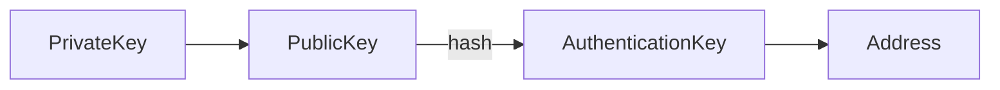
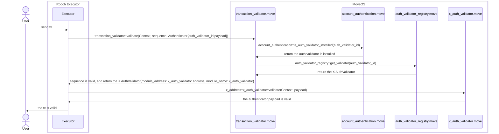

# Design and Implementation of Account Abstraction

The essence of account abstraction is to allow developers to verify transactions through their custom code logic. One common approach in the industry is to transform the user's account into a type of smart contract wallet, with the associated logic implemented by that smart contract.
This solution provides ample flexibility, but it also brings some problems, for example, users need to deploy a contract in advance, and contract upgrades can result in compatibility issues.

As a remedy to this, Rooch's solution involves the design of Authentication Abstraction. Developers can implement account abstraction by creating an Authentication Validator.

## Authentication Abstraction

Currently, the primary method used to verify identities on the blockchain is through private key signatures: verifying the relation between "PrivateKey" -> "PublicKey" -> "Address" to confirm if the transaction sender has the authority to operate the state of the corresponding address.
But if we introduce an abstraction layer such that the account address is no longer directly bound to the private key, then we provide a basis for authentication abstraction.

In Rooch, the relationship between the private key, public key, and account address is as follows:



The initial value of `AuthenticationKey` is the same as `address`, but since `AuthenticationKey` is stored in the contract, its relationship with `address` can be changed. Different authentication validators can have their own methods of calculating `AuthenticationKey`.
This allows us to decouple `address` and `PrivateKey`.

## Authentication Validator

Based on the above abstraction, we can implement account abstraction by defining custom authentication validators. An authentication validator is a smart contract, which primarily verify the identity of the sender of a transaction.

The authentication validator should include the following methods:

```move
public fun validate(ctx: &Context, authenticator_payload: vector<u8>);
fun pre_execute(ctx: &mut Context);
fun post_execute(ctx: &mut Context);
```

The `validate` method is used to check the validity of a transaction, while `pre_execute` and `post_execute` methods are used for operations before and after the transaction execution, such as the initialization and updating of states.

To express in the transaction which `validator` is being used, the Rooch transactions include an `authenticator` field:

```rust
pub struct RoochTransaction {
    data: RoochTransactionData,
    authenticator: Authenticator,
}
```

The structure of `Authenticator` is as follows:

```rust
struct Authenticator {
   pub auth_validator_id: u64,
   pub payload: Vec<u8>,
}
```

The `auth_validator_id` is used to identify the authentication validator, while `payload` stores data needed by the validator. 
Developers' custom-made authentication validators need to be registered in the validator registration contract. After registration, they are assigned an `auth_validator_id`.
When users initiate transactions, they can specify their `auth_validator_id` to indicate which validator should verify the current transaction.
Of course, to ensure the safety of transactions, users need to initiate transactions and install the validator ahead of time. The installation operation will write the validator’s `auth_validator_id` to the user's on-chain configuration.

The diagram below illustrates the transaction verification process in Rooch:



Currently, Rooch includes the following built-in validators:

1. [Native Auth Validator](https://github.com/rooch-network/rooch/blob/main/frameworks/rooch-framework/sources/auth_validator/native_validator.move) : A Validator based on the Ed25519 algorithm. The validator’s `auth_validator_id` is 0, making it the default validator.
2. [Ethereum Auth Validator](https://github.com/rooch-network/rooch/blob/main/frameworks/rooch-framework/sources/auth_validator/ethereum_validator.move) : A Validator based on the Ethereum signature algorithm, with `auth_validator_id` being 1. 

A Web2 social login validator is currently under development. Please refer [Github issue #769 ](https://github.com/rooch-network/rooch/issues/769) for updates.
To learn how to develop a custom validator, you can refer to [examples/noop_auth_validator](https://github.com/rooch-network/rooch/blob/main/examples/noop_auth_validator).  

## SessionKey

A SessionKey is a temporary private key used for signing transactions. It is stored in the app instead of in the wallet to avoid the need for the user to sign through the wallet for every operation, thereby enhancing the user experience.

The SessionKey defined in the contract is as follows:

```move
    struct SessionScope has store,copy,drop {
        /// The scope module address, the address can not support `*`
        module_address: address,
        /// The scope module name, `*` means all modules in the module address
        module_name: std::ascii::String,
        /// The scope function name, `*` means all functions in the module
        function_name: std::ascii::String,
    }

    struct SessionKey has store,copy,drop {
        /// The session key's authentication key, it also is the session key's id
        authentication_key: vector<u8>,
        /// The session key's scopes
        scopes: vector<SessionScope>,
        /// The session key's create time, current timestamp in seconds
        create_time: u64,
        /// The session key's last active time, in seconds
        last_active_time: u64,
        /// The session key's max inactive time period, in seconds
        /// If the session key is not active in this time period, it will be expired
        /// If the max_inactive_interval is 0, the session key will never be expired
        max_inactive_interval: u64,
    }
```

The actual stored data in the contract is the `AuthenticationKey` for the temporary private key, not the private key itself. The authentication validator validates the transaction's validity based on the `AuthenticationKey`.

The `scopes` of `SessionKey` define the scope of contracts that this private key can operate. For instance, it could specify a function of a certain contract, all the functions of a contract, or all contracts of an address.
The `max_inactive_interval` of the `SessionKey` sets its expiration term. If the current time subtracted by the `last_active_time` is greater than `max_inactive_interval`, the private key expires.

## GasFree Transaction

A GasFree transaction doesn't mean that the transaction doesn't need to pay gas fees. Instead, the gas costs for these transactions are paid by the developer. Gas mechanism is a important measure to prevent Sybil attacks and to ensure permissionless in blockchain systems.

There are several main challenges in designing GasFree transactions:

1. How to indicate that a transaction is a GasFree transaction.
2. How to prevent malicious users from abusing GasFree transactions to drain the developer's gas fees.
3. How to provide an extension mechanism that allows developers to implement an in-app Gas deduction system.

The design for GasFree transactions in Rooch is currently underway. Interested parties can follow [Github issue #839](https://github.com/rooch-network/rooch/issues/839) for updates.