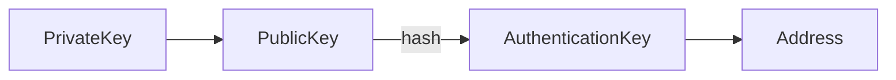
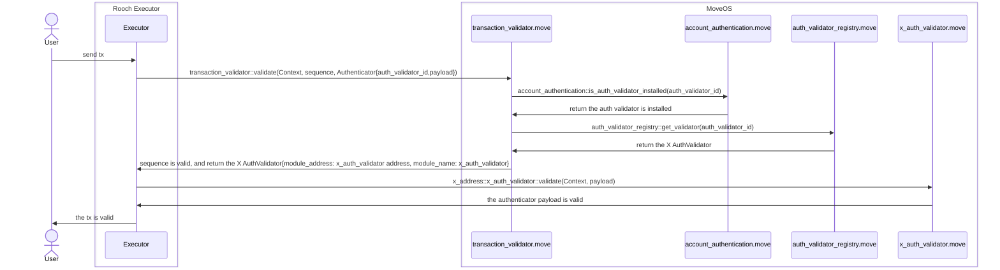

# 账户抽象的设计与实现

账户抽象的关键是让开发者可以通过自定义的代码逻辑来校验交易。业界一般采用的一种方案是将用户的账户变为一种智能合约钱包，账户相关的逻辑由该智能合约实现。
这种方案提供了足够的灵活性，但是也带来了一些问题，比如：用户需要先部署一个合约，合约升级也会带来兼容性问题。

对于这个问题，Rooch 的解决方案是设计一种身份验证抽象（Authentication Abstraction），开发者可以通过实现一个身份验证器（Authentication Validator）来实现账户抽象。

## 身份验证抽象（Authentication Abstraction）

当前，区块链上用来验证身份的主要方式是通过私钥签名，验证 “PrivateKey” -> "PublicKey" -> "Address" 之间的关系，来确定交易发送方是否有权限操作该地址所属的状态。
而如果我们做一层抽象，账户地址不再和私钥直接绑定，那我们就为身份验证抽象提供了基础。

Rooch 中，私钥，公钥，账户地址之间的关系如下：



其中 `AuthenticationKey` 的初始值和 `address` 是一致的，但是 `AuthenticationKey` 保存在合约中，它和 `address` 之间的关系可以变更，而不同的身份验证器可以有自己的 `AuthenticationKey` 计算方式。
这样，我们实现了 `address` 和 `PrivateKey` 的解耦。

## 身份验证器（Authentication Validator）

基于上面的抽象，我们可以通过自定义身份验证器来实现账户抽象。身份验证器是一个智能合约，它的主要功能是校验交易发送者的身份。

身份验证器需要包含以下方法：

```move
public fun validate(ctx: &Context, authenticator_payload: vector<u8>);
fun pre_execute(ctx: &mut Context);
fun post_execute(ctx: &mut Context);
```

其中 `validate` 方法用来校验交易的合法性，`pre_execute` 和 `post_execute` 方法用来在交易执行前后做一些操作，比如初始化状态，或者更新状态。

为了能在交易中表达，该交易使用的是那个 `validator`，Rooch 交易中包含了 `authenticator` 字段:

```rust
pub struct RoochTransaction {
    data: RoochTransactionData,
    authenticator: Authenticator,
}
```

`Authenticator` 的结构如下：

```rust
struct Authenticator {
   pub auth_validator_id: u64,
   pub payload: Vec<u8>,
}
```

其中 `auth_validator_id` 用来标识身份验证器，`payload` 用来存储验证器需要的数据。开发者自定义的身份验证器，需要在验证器注册中心合约注册，注册后会获得一个 `auth_validator_id`。
然后应用发起交易的时候，通过指定 `auth_validator_id` 来表明当前交易使用哪个验证器进行校验。
当然为了保证交易的安全，用户需要提前发起交易，先安装该验证器，安装操作会将验证器的 `auth_validator_id` 写到用户的链上配置中。

下图是 Rooch 中交易验证的流程图：



当前，Rooch 中内置了以下验证器：

1. [Native Auth Validator](https://github.com/rooch-network/rooch/blob/main/frameworks/rooch-framework/sources/auth_validator/native_validator.move) : 基于 Ed25519 算法的验证器，验证器的 `auth_validator_id` 为 0，是默认的验证器。
2. [Ethereum Auth Validator](https://github.com/rooch-network/rooch/blob/main/frameworks/rooch-framework/sources/auth_validator/ethereum_validator.move) : 基于 Ethereum 签名算法的验证器，验证器的 `auth_validator_id` 为 1。 

Web2 社交登陆的验证器正在开发中，可以关注 [Github issue #769 ](https://github.com/rooch-network/rooch/issues/769)。
如果想了解如何开发自定义的验证器，可以参考 [examples/noop_auth_validator](https://github.com/rooch-network/rooch/blob/main/examples/noop_auth_validator)。  

## 会话私钥（SessionKey）

会话私钥是一种临时的私钥，它可以用来签名交易，但保存在应用中，而不是钱包中，避免用户每次操作都需要通过钱包签名，从而提高用户体验。

合约中的 SessionKey 定义如下：

```move
    struct SessionScope has store,copy,drop {
        /// The scope module address, the address can not support `*`
        module_address: address,
        /// The scope module name, `*` means all modules in the module address
        module_name: std::ascii::String,
        /// The scope function name, `*` means all functions in the module
        function_name: std::ascii::String,
    }

    struct SessionKey has store,copy,drop {
        /// The session key's authentication key, it also is the session key's id
        authentication_key: vector<u8>,
        /// The session key's scopes
        scopes: vector<SessionScope>,
        /// The session key's create time, current timestamp in seconds
        create_time: u64,
        /// The session key's last active time, in seconds
        last_active_time: u64,
        /// The session key's max inactive time period, in seconds
        /// If the session key is not active in this time period, it will be expired
        /// If the max_inactive_interval is 0, the session key will never be expired
        max_inactive_interval: u64,
    }
```
合约中保存的实际是该临时私钥的 `AuthenticationKey`，而不是私钥本身，身份验证器会根据 `AuthenticationKey` 来验证交易的合法性。

`SessionKey` 的 `scopes` 定义了该私钥可以操作的合约范围，比如可以指定某个合约的某个函数，或者某个合约的所有函数，或者某个地址的所有合约。
`SessionKey` 的 `max_inactive_interval` 定义了该私钥的有效期，如果当前时间减去 `last_active_time` 大于 `max_inactive_interval`，则该私钥失效。

## 免 Gas 交易（GasFree Transaction）

免 Gas 交易并不是说该交易不需要付费 Gas 费，而是该交易的 Gas 费由开发者代付。Gas 机制是区块链系统防止女巫攻击和保证无准入限制（Permissionless）的重要手段。

GasFree 设计的主要有以下难点：

1. 如何标明某个交易是 GasFree 交易。
2. 如何防止被恶意用户滥用 GasFree 交易，乃至耗光开发者的 Gas 费。
3. 如何提供扩展机制，让开发者实现应用内的 Gas 抵扣机制。

Rooch 的 GasFree 交易正在设计中，感兴趣可以关注 [Github issue #839](https://github.com/rooch-network/rooch/issues/839)。 
