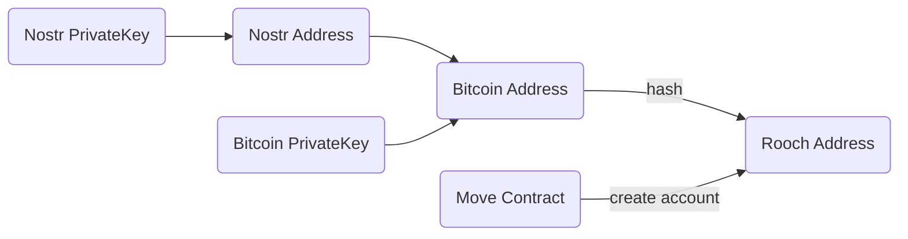

## Accounts and Addresses

In Rooch, there are two types of accounts: external accounts and contract accounts. External accounts are controlled by Bitcoin private keys, while contract accounts are controlled by contract code. To standardize address formats, Rooch maps various Bitcoin addresses to a unified address using a hash function. The addresses of contract accounts are generated by an ID generation algorithm within the contract.

The address generation process is illustrated as follows:



## Address Format

A Rooch address is a 32-byte array that can be represented as a hexadecimal string starting with `0x` or encoded using bech32. For end-user scenarios, we recommend using bech32 encoding because it is more user-friendly and helps prevent input errors.

Here are some address examples, The following addresses are all representations of the same address on different networks or in different encodings:

```txt
Bitcoin: bc1pxvkmv75yg6k0n84ypmak8ecclsnnpzq5qlf6r6nfjau2wp40cr6q2erlqm
Bitcoin testnet: tb1pxvkmv75yg6k0n84ypmak8ecclsnnpzq5qlf6r6nfjau2wp40cr6qa34s65
Bitcoin regnet: bcrt1pxvkmv75yg6k0n84ypmak8ecclsnnpzq5qlf6r6nfjau2wp40cr6qsglk0w
Rooch bech32: rooch17ctexjpxpgeeu9txdss4aayar5244yhxl33m3w5fvvhn6f0x0t7sq20maz
Rooch hex: 0xf6179348260a339e15666c215ef49d1d155a92e6fc63b8ba89632f3d25e67afd
Nostr address: npub1gxhzh89u420kjvwxxytzpnp4gzd7h9vl7krv9cvugpzdxqt0r2wql0ksrg
```

## Reserved Address Space

Rooch reserves address space for the Move standard library and the framework to facilitate developer use.

* Move Standard Library Address: `0x1`
* MoveOS Library Address: `0x2`
* RoochFramework Address: `0x3`
* BitcoinMove Address: `0x4`

> Note: In developer scenarios, such as in Move code and Move.toml configurations, addresses need to be represented as hexadecimal strings starting with `0x`.

## FAQ

### Are there differences between testnet and mainnet addresses?

Bitcoin testnet and mainnet addresses are different, but once mapped to Rooch addresses, they are the same.

### How do I convert a Bitcoin address to a Rooch address?

A Bitcoin address can be directly converted to a Rooch address via code without the need for a lookup. Refer to the specific SDK for your programming language. Below is a Rust example:

```rust
/// Convert the Bitcoin address to a Rooch address
pub fn to_rooch_address(&self) -> RoochAddress {
    let mut hasher = Blake2b256::default();
    hasher.update(&self.bytes);
    let g_arr = hasher.finalize();
    RoochAddress(H256(g_arr.digest))
}
```

* [address.rs#L647-L653](https://github.com/rooch-network/rooch/blob/92792257f5b832312019d9440618b9af83e89547/crates/rooch-types/src/address.rs#L647-L653)

### How do I find the corresponding Bitcoin address from a Rooch address?

Not all Rooch addresses have corresponding Bitcoin addresses. To retrieve them, use the `rooch_framework::address_mapping::resolve_bitcoin` method.

```move
/// Resolve a Rooch address to a Bitcoin address
public fun resolve_bitcoin(rooch_address: address): Option<BitcoinAddress> {
    let am = Self::borrow_rooch_to_bitcoin();
    Self::resolve_bitcoin_address(am, rooch_address)
}
```

* [address_mapping.move#L104-L108](https://github.com/rooch-network/rooch/blob/92792257f5b832312019d9440618b9af83e89547/frameworks/rooch-framework/sources/address_mapping.move#L104-L108)

### What type of address should be used when calling RPC?

Rooch's RPC and command-line tool address parameters support both Bitcoin addresses and Rooch addresses. Developers can choose based on their needs.

### How to Create a Contract Account?

To create a contract account, call the `moveos_std::account::create_account` method within the contract. This method returns an `Object<Account>`. Developers can store this object in their data structure and use it to operate the contract account.

```move
/// Create an Account Object with a generated address
public fun create_account(): Object<Account> {
  let new_address = tx_context::fresh_address();
  create_account_object(new_address)
}
```