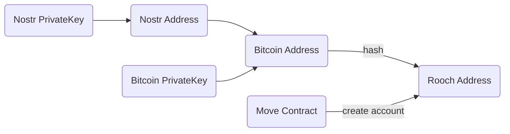

## 账户与地址

在 Rooch 中，有两类账户：外部账户和合约账户。外部账户由 Bitcoin 私钥控制，合约账户由合约代码控制。为了统一地址格式，Rooch 通过哈希函数将 Bitcoin 的多种地址映射到统一的地址，而合约账户的地址则通过合约内的 ID 生成算法生成。

地址生成示意图如下：



## 地址格式

Rooch 地址是一个 32 字节的数组，可以表示为以 `0x` 开头的十六进制字符串，或使用 bech32 编码。在面向最终用户的场景中，我们推荐使用 bech32 编码，因为这种编码更友好，且可以减少用户输入错误。

地址示例如下，以下地址都是同一个地址在不同网络或者不同编码下的表示：

```txt
Bitcoin: bc1pxvkmv75yg6k0n84ypmak8ecclsnnpzq5qlf6r6nfjau2wp40cr6q2erlqm
Bitcoin testnet: tb1pxvkmv75yg6k0n84ypmak8ecclsnnpzq5qlf6r6nfjau2wp40cr6qa34s65
Bitcoin regnet: bcrt1pxvkmv75yg6k0n84ypmak8ecclsnnpzq5qlf6r6nfjau2wp40cr6qsglk0w
Rooch bech32: rooch17ctexjpxpgeeu9txdss4aayar5244yhxl33m3w5fvvhn6f0x0t7sq20maz
Rooch hex: 0xf6179348260a339e15666c215ef49d1d155a92e6fc63b8ba89632f3d25e67afd
Nostr address: npub1gxhzh89u420kjvwxxytzpnp4gzd7h9vl7krv9cvugpzdxqt0r2wql0ksrg
```

## 系统预留地址空间

Rooch 为 Move 标准库和框架预留了地址空间，方便开发者使用。

* Move 标准库地址：`0x1`
* MoveOS 库地址：`0x2`
* RoochFramework 地址：`0x3`
* BitcoinMove 地址：`0x4`

> 注：在开发者场景（如 Move 代码和 Move.toml 配置中），需要使用以 `0x` 开头的十六进制字符串表示地址。

## 常见问题 (FAQ)

### 测试网地址和主网地址是否有区别？

Bitcoin 的测试网地址和主网地址有区别，但映射成 Rooch 地址后，两者是一样的。

### 如何通过 Bitcoin 地址查询对应的 Rooch 地址？

Bitcoin 地址可以直接通过代码生成对应的 Rooch 地址，不需要查询。具体方法请参考相关开发语言的 SDK。以下是 Rust 示例：

```rust
/// 将 Bitcoin 地址转换为 Rooch 地址
pub fn to_rooch_address(&self) -> RoochAddress {
    let mut hasher = Blake2b256::default();
    hasher.update(&self.bytes);
    let g_arr = hasher.finalize();
    RoochAddress(H256(g_arr.digest))
}
```

* [address.rs#L647-L653](https://github.com/rooch-network/rooch/blob/92792257f5b832312019d9440618b9af83e89547/crates/rooch-types/src/address.rs#L647-L653)

### 如何通过 Rooch 地址查询对应的 Bitcoin 地址？

并不是所有的 Rooch 地址都有对应的 Bitcoin 地址，需要通过 `rooch_framework::address_mapping::resolve_bitcoin` 方法来检索。

```move
/// 将 Rooch 地址解析为 Bitcoin 地址
public fun resolve_bitcoin(rooch_address: address): Option<BitcoinAddress> {
    let am = Self::borrow_rooch_to_bitcoin();
    Self::resolve_bitcoin_address(am, rooch_address)
}
```

* [address_mapping.move#L104-L108](https://github.com/rooch-network/rooch/blob/92792257f5b832312019d9440618b9af83e89547/frameworks/rooch-framework/sources/address_mapping.move#L104-L108)

### 调用接口时应该使用什么样的地址？

Rooch 的 RPC 接口和命令行工具的地址参数同时支持 Bitcoin 地址和 Rooch 地址，开发者可以根据需求选择使用。

### 如何创建合约账户？

在合约中调用 `moveos_std::account::create_account` 方法，会返回 `Object<Account>`。开发者可以把该对象存储到自己的数据结构中，通过该对象来操作合约账户。

```move
/// Create an Account Object with a generated address
public fun create_account(): Object<Account> {
  let new_address = tx_context::fresh_address();
  create_account_object(new_address)
}
```