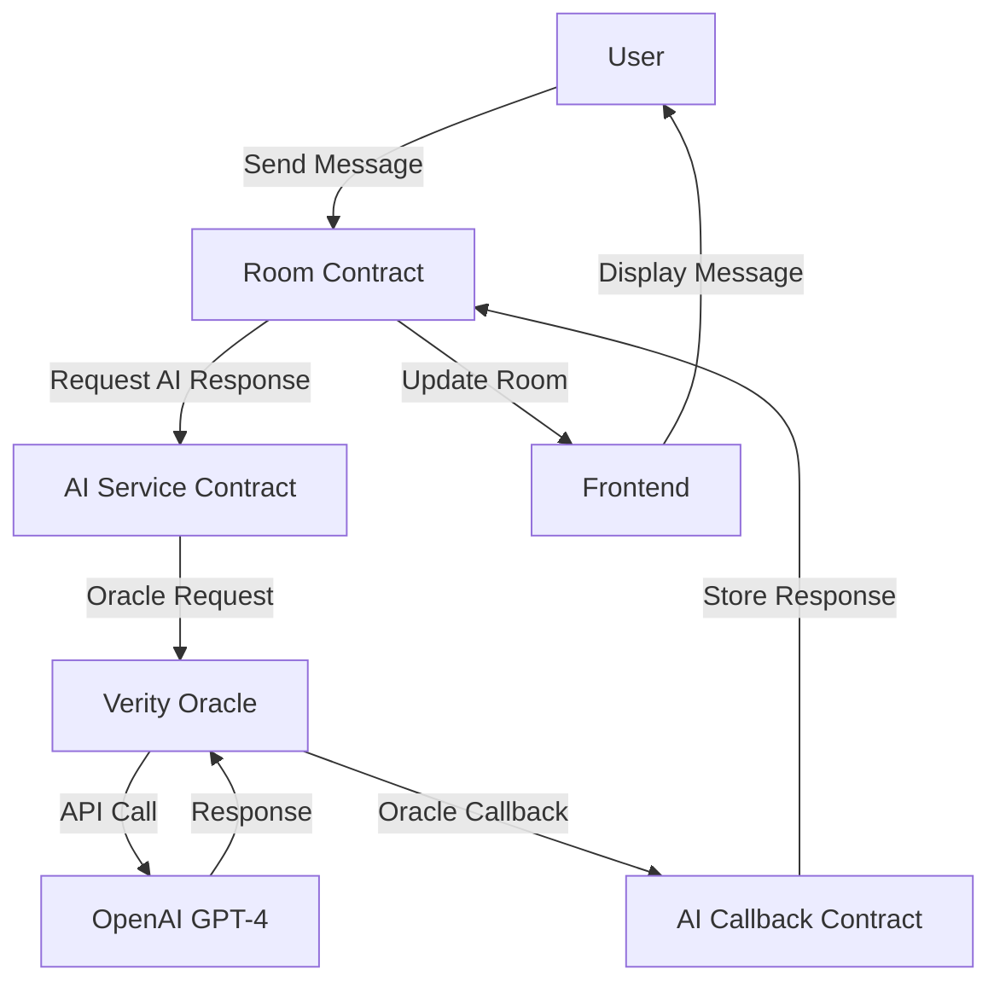

# Onchain AI Chat

A decentralized AI chat platform built on Rooch blockchain with Verity Oracle integration.

## Features

- AI-powered chat rooms with GPT-4o integration
- Real-time messaging with context awareness
- On-chain message storage and persistence
- Automatic conversation summarization
- Paginated message history
- Real-time updates

## Live Demo

Visit [ai.rooch.io](https://ai.rooch.io) to try the application.

## Architecture

### Smart Contracts

- `room.move`: Main chat room functionality including message handling
- `ai_service.move`: AI integration service using Verity Oracle
- `ai_callback.move`: Handles AI response callbacks

### Frontend

- React-based web interface
- Real-time updates using Rooch SDK
- Material design UI components
- Message pagination and infinite scroll

## How It Works



The application follows these steps:

1. User sends a message through the web interface
2. Message is stored in the Room contract
3. AI Service contract initiates an oracle request
4. Verity Oracle calls OpenAI's API
5. Response is processed through the callback contract
6. Message is stored on-chain and displayed to users

## Future Features
1. Integration with OnChain AI Agent ecosystem
2. Plugin SDK for extending chat functionality
3. Custom command handlers and message processors
4. More AI model integration support
5. Developer documentation and example plugins

## Prerequisites

- [Rooch](https://rooch.network) development environment
- Node.js v16+ and npm/yarn

## Development

### Local Setup

1. Clone the repository:
```bash
git clone https://github.com/rooch-network/rooch.git
cd rooch/examples/onchain_ai_chat
```

2. Deploy the smart contracts:

```bash
rooch env switch --alias test
rooch move publish --named-addresses onchain_ai_chat=default
```

3. Start the frontend:

```bash
cd web
pnpm install
# change the PACKAGE_ID in the web/src/constants.ts file to the deployed contract address
pnpm dev
```
More details can be found in the [web README](web/README.md).
