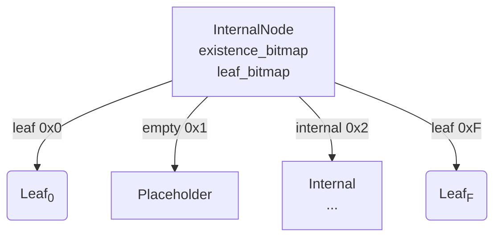

# Rooch Sparse Merkle Tree (SMT) 实现概览

> 本文件面向二次开发者 / 代码阅读者，帮助快速理解 **`moveos/smt`** 目录下的状态树（Jellyfish Merkle Tree 变体）实现，并给出常见使用范式。

---

## 1. 目录结构

```text
moveos/smt/
 ├── src/
 │   ├── hash.rs            // Hash 工具 & 常量
 │   ├── nibble*.rs         // Nibble 及迭代器
 │   ├── node_type/         // Internal / Leaf / Null 节点
 │   ├── iterator/          // 树遍历实现
 │   ├── proof.rs           // 包含 / 区间证明
 │   ├── tree_cache/        // 写入批次缓存
 │   ├── jellyfish_merkle/  // 核心算法封装
 │   ├── smt_object.rs      // Key / Value Trait + 包装器
 │   ├── lib.rs             // 高层 API：SMTree
 │   └── tests/             // 集成 / 属性测试
 └── README.md              // 原始英文简介
```

Rooch 采用 **Jellyfish Merkle Tree** 的高效变体，分为两层封装：

1. **`jellyfish_merkle/*`**：纯算法层，实现节点组织、哈希计算、批量变更、证明生成。
2. **`lib.rs` → `SMTree`**：业务层友好 API，提供 `put / remove / get / iter` 等接口并接入 Prometheus 指标。

---

## 2. Hash 与地址空间

### 2.1 `SMTNodeHash`

* 使用带域隔离的 SHA-256（`sha256t_hash_newtype!`）产出 32 字节哈希。
* `LEN_IN_BITS = 256`，对应树最大深度；nibble 级为 512 层。
* 提供 `bit()` / `nibble()` / `iter_bits()` 等辅助方法。

### 2.2 Placeholder

`SPARSE_MERKLE_PLACEHOLDER_HASH_VALUE` 作为"空子树哈希"，确保结构可验证。

---

## 3. 节点类型（`node_type`）

### 3.1 `InternalNode`

* 16 个子指针，把二叉树 4 层压缩成 1 层，降低 IO/深度。
* 位图设计
  * `existence_bitmap`：子节点是否存在
  * `leaf_bitmap`：对应子节点是否为叶子
* 递归 `make_hash()` —— 若区间全空 ➜ placeholder；仅 1 个叶子 ➜ 直接返回该叶子哈希；否则合并左右子区间哈希。

### 3.2 `LeafNode`

* 保存 `(origin_key, SMTObject<V>)`。
* 哈希 = `SparseMerkleLeafNode(key_hash, value_hash)`。

### 3.3 `Node` 枚举

```rust
enum Node { Null, Internal(InternalNode), Leaf(LeafNode) }
```

* 统一哈希、序列化、`is_leaf()` 等操作。
* `NodeKey = SMTNodeHash`，即节点索引就是自身哈希。

---

## 4. Nibble & 路径

* `Nibble(u8)`：4 bit 值 (0-15)。
* `NibblePath` 将 nibble 列表压缩到 `Vec<u8> + num_nibbles`。
* `NibbleIterator` / `BitIterator` 用于遍历；`skip_common_prefix` 用于插入时寻找分叉。

---

## 5. 核心算法 —— `JellyfishMerkleTree`

### 5.1 抽象存储

```rust
trait TreeReader { fn get_node_option(&self, key: &NodeKey) -> Result<Option<Node>> }
trait TreeWriter { fn write_node_batch(&self, batch: NodeBatch) -> Result<()> }
```

任何实现上述接口的后端（RocksDB、内存等）都可即插即用。

### 5.2 `TreeCache`

一次 `puts` 调用的写时缓存，用于收集：
* `node_cache` —— 新增 / 修改节点
* `stale_node_index_cache` —— 被替换的旧节点

写流程：
1. 从旧根递归下探，查找分叉点。
2. 生成新节点放入 `node_cache`，旧节点加入 `stale_node_index_cache`。
3. `freeze()` 后输出 `TreeUpdateBatch`，由上层一次性持久化。

### 5.3 更新接口

* `insert_all(state_root, Vec<(K, SMTObject<V>)>)`
* `updates(state_root, Vec<(K, Option<SMTObject<V>>)>)`

返回 `(new_root_hash, TreeUpdateBatch)`，调用者落盘后新根才生效。

### 5.4 查询 & 证明

* `get_with_proof(root, key)` 生成 `SparseMerkleProof { leaf?, siblings }`，客户端可调用 `verify()`。
* `get_range_proof(root, rightmost_key)` 生成区间证明。

### 5.5 遍历

`JellyfishMerkleIterator` 采用 DFS+栈，输出按字典序排序的键值对。

### 5.6 基本操作算法（伪代码）

#### 插入 / 更新 (`put`)

1. 计算 `key_hash = hash(key)`，生成 `NibblePath`。
2. 从 `state_root` 开始，依次读取 `InternalNode`，根据 nibble 下钻：
   * 若命中 `Null`：直接替换成 `Leaf(key, value)`。
   * 若命中 `Leaf`：
     * `key_hash` 相同 ➜ 更新值。
     * 否则找到二者分叉 nibble，新建若干 `InternalNode`，把原叶子和新叶子挂进去。
3. 递归回溯，沿途节点哈希全部重算，写入 `TreeCache`。
4. 返回 `new_root_hash` + `TreeUpdateBatch`。

#### 删除 (`remove`)

1. 同样下钻到目标 `Leaf`。
2. 将其标记为 stale，并在父 `InternalNode` 中移除对应 child。
3. 若父节点删除后只剩 0 个 child ➜ 变为 `Null`；只剩 1 个 `Leaf` ➜ 父节点被该叶子"坍缩"。
4. 继续向上回溯更新哈希、记录 stale 节点。

#### 批量操作 (`puts`)

1. 创建一次 `TreeCache`。
2. 对同一批次的 `(key, Option<value>)` 逐条调用 `insert_at`（或 delete 分支）。
3. 每条更新结束 `TreeCache.freeze()`，将阶段性结果写入 `FrozenTreeCache`，保证早期节点只读。
4. 所有更新完成后，返回最后一个 `root_hash` 与合并后的 batch。

#### 查询 (`get_with_proof`)

1. 同样按 nibble 下钻，沿途收集 sibling 哈希。
2. 根据落点情况产生三种 proof：
   * `Some(leaf)` ➜ 包含证明
   * 同一子树存在其它叶子 ➜ 排他不包含证明
   * 子树全空 ➜ 空证明
3. 客户端重放 sibling & 叶子哈希重建 root，与预期 root 比对。

#### 遍历 (`iterator`)

深度优先遍历：
* 栈保存 `(InternalNode, next_child_to_visit)`。
* 初始化时根据 `starting_key` 定位到首个 ≥ key 的叶子。
* `next()` 弹出当前叶子后调用 `cleanup_stack()`：
  * 若父节点还有未访问子树则 advance；
  * 否则逐层回溯，直到找到下一个可下探的子树。
* 直到栈空并 `done = true`。

> 以上流程均保证 **O(log N)** 复杂度（以 nibble 为单位），并利用 16 叉节点减少常数因子。

---

## 6. 高层封装 —— `SMTree`

```rust
pub struct SMTree<K, V, NR> { /* NodeReader + Metrics */ }
```

* API：`put/remove/get/contains/puts/iter/list/dump/get_with_proof`。
* 指标：`metrics.rs` 通过 Prometheus `HistogramVec` 记录延迟和字节数。

### 6.1 基本用法示例

```rust
let store = InMemoryNodeStore::default();
let registry = Registry::new();
let smt: SMTree<MyKey, MyValue, _> = SMTree::new(store.clone(), &registry);

// 插入
let cs = smt.put(H256::zero(), key1, val1)?;
store.write_nodes(cs.nodes)?;              // 持久化
let root = cs.state_root;

// 查询 + 证明
let (v, proof) = smt.get_with_proof(root, key1)?;
proof.verify(root, key1, Some(val1))?;

// 删除
let cs2 = smt.remove(root, key1)?;
store.write_nodes(cs2.nodes)?;
```

---

## 7. 结构示意 (Mermaid)



---

## 8. 测试与验证

* 单元测试覆盖编码/解码、插入、删除、迭代、极端路径。
* `proptest!` 随机生成 KV / 版本，验证树 & 证明始终一致。
* `MockTreeStore` 提供 `purge_stale_nodes()`，模拟旧版本 GC。

执行全部测试：

```bash
make test             # 全项目
cargo test -p smt     # 仅 SMT crate
```

---

## 9. 进阶话题

* **垃圾回收**：根哈希废弃后可 `purge_stale_nodes(root_hash)` 释放空间。
* **多版本共存**：树的根哈希直接作为版本号；无需额外自增序列。
* **安全**：所有节点自描述，证明同时支持「存在」与「不存在」两种语义。
* **性能**：InternalNode 4-层压缩 + 位图；`puts` 在单批次合并多次修改。

---

> 如有疑问或改进意见，欢迎在 GitHub PR / Issue 交流。 